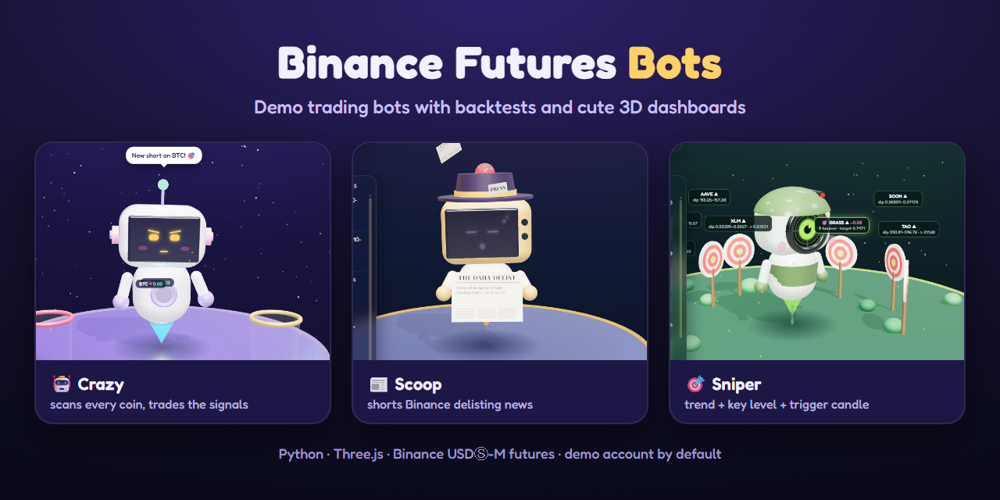
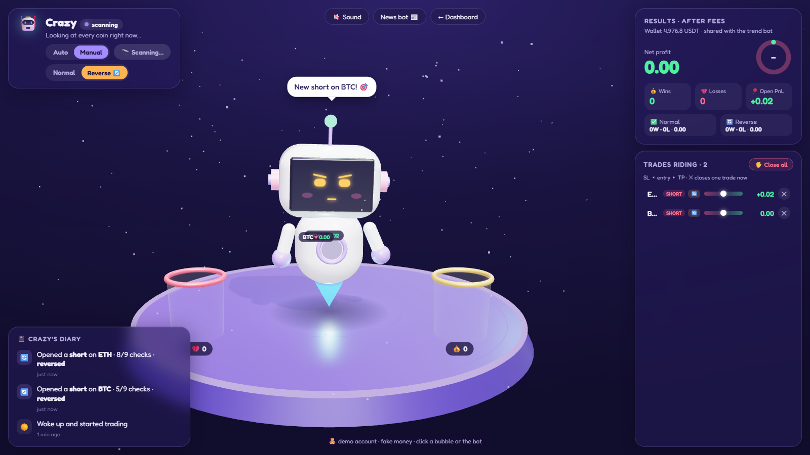
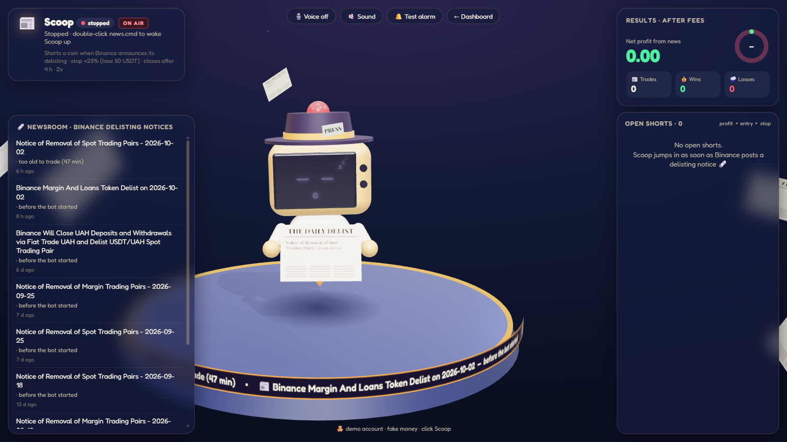
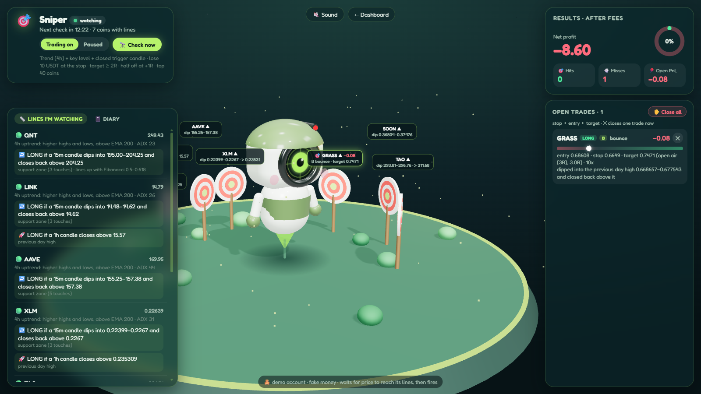

# Binance Futures Bots


Four trading bots for **Binance USDⓈ-M futures**, each with its own strategy and its own cute 3D page, plus the
backtests and research notes behind them. Everything runs on Binance's **demo account (fake money)** by default.



> **Disclaimer:** this project is for learning and experimenting on Binance's demo account. It is **not financial advice**.
> Trading futures with real money can lose more than you expect, quickly. The strategies here are experiments; several
> lost money in the included backtests (see `LEARNING.md` and `data/*/report.md`). Use it at your own risk: the authors
> accept no responsibility for any losses. Real-money trading is off unless you deliberately enable it in `.env`.

## Meet the bots

| Bot | Strategy | Start it | Its page |
|---|---|---|---|
| 📈 **Trend bot** | Daily breakouts: buys when a daily candle closes above its 55-day high and the 100 EMA, then trails the stop under the 20-day low. The one strategy that passed the long-term backtests. | `start.cmd` | the main dashboard |
| 🤖 **Crazy** | Scans every liquid coin, long and short, scoring 9 classic YouTube confirmations. Every trade risks $2 to make $2. Manual or hourly scans, a Reverse mode, close trades by hand. | `crazy.cmd` | `/bot` |
| 📰 **Scoop** | News trading: watches Binance's delisting announcements every 2 seconds and shorts the coin right after the news. | `news.cmd` | `/news` |
| 🎯 **Sniper** | Trades like a discretionary trader: 4h trend + key support/resistance level + a *closed* trigger candle at that level. Targets at least 2× the risk, takes half off at +1R. | `sniper.cmd` | `/sniper` |

<table>
<tr>
<td></td>
<td></td>
<td></td>
</tr>
<tr>
<td align="center"><b>Crazy</b>: trades orbit the robot; wins drop into the coin jar</td>
<td align="center"><b>Scoop</b>: live news ticker, BREAKING banner, reads headlines aloud</td>
<td align="center"><b>Sniper</b>: every coin with lines is a target; a laser fires on a trigger</td>
</tr>
</table>

## What the research found

The bots came out of a series of experiments, all documented in [LEARNING.md](LEARNING.md) with the backtest reports in `data/*/report.md`. The honest highlights:

- **Stacking confirmations doesn't create an edge.** Crazy's 9 confirmations, replayed on 3 years of hourly candles for 24 coins, won 50.0% of trades against 49.5% for random direction. Breaking even after fees needs 52.2%. Requiring 7 or 9 confirmations didn't help either.
- **Most short-term YouTube setups lost money** in the lab (liquidity sweeps, EMA pullbacks, breakout and retest).
- **Daily trend following passed:** it wins only ~40% of trades, but lets the winners run.
- **Delisting news has an edge you don't need to be fast for:** shorting 1 minute after a Binance delisting notice and closing 4 hours later made about +5.6% per trade after costs over 133 trades (2023–2026), with a 25% stop. Entering 15 minutes late still worked.

## Quick start

You need **Python 3.10+** and a Binance account. The `.cmd` launchers are for Windows; on macOS or Linux run the same `python ... run` commands shown below.

### 1. Get demo API keys

1. Log in at https://demo.binance.com. It uses your normal Binance account and its fake USDT balance.
2. Open the profile menu, then **API Management**, then **Create API**.
3. Turn on **Enable Futures**. Leave withdrawals off.
4. Copy the **API Key** and **Secret Key**. The secret is only shown once.

If demo.binance.com doesn't work in your region, try https://testnet.binancefuture.com and set
`BINANCE_BASE_URL=https://testnet.binancefuture.com` in `.env`.

### 2. Install

```powershell
git clone https://github.com/asheint/futures-bot.git
cd futures-bot
python -m venv .venv
.\.venv\Scripts\Activate.ps1          # macOS/Linux: source .venv/bin/activate
pip install -r requirements.txt
copy .env.example .env                # macOS/Linux: cp .env.example .env
```

Paste your demo keys into `.env`. Never share `.env` or upload it anywhere; git already ignores it.

### 3. Run a bot

Double-click one of the launchers. Each starts the bot, starts the local dashboard if it isn't running, and opens the bot's page:

- `sniper.cmd` → http://127.0.0.1:8000/sniper
- `crazy.cmd` → http://127.0.0.1:8000/bot
- `news.cmd` → http://127.0.0.1:8000/news
- `start.cmd` → the trend bot and the main dashboard at http://127.0.0.1:8000

The main dashboard's top bar links to every bot page. Each bot's settings (risk per trade, leverage, targets) are in `.env`, with comments.
The trend bot has its own complete guide: [BOT_GUIDE.md](BOT_GUIDE.md).

## Safety

- **Demo by default.** Real money needs `BINANCE_ENV=live` **and** `ALLOW_LIVE_TRADING=yes` in `.env`. Crazy, Scoop and Sniper refuse to run on a live account at all.
- **Every trade has a stop-loss on Binance** right after entry. If the stop can't be placed, the bot closes the position immediately.
- **Isolated margin**, sized from the stop distance, with leverage kept low enough that liquidation sits well beyond the stop.
- The bots share one account unless you give Crazy its own keys (`CRAZY_API_KEY` / `CRAZY_API_SECRET` in `.env`). Binance allows one position per coin, so a coin one bot holds is skipped by the others.

## All commands

| Command | What it does |
|---|---|
| `python sniper_bot.py run` | Sniper: draws its lines every 15 minutes and fires on closed trigger candles |
| `python sniper_bot.py plan` | Prints every coin's trend and lines right now, without trading |
| `python crazy_bot.py run` | Crazy: Manual by default (press Scan now on its page), or hourly in Auto |
| `python crazy_bot.py scan` / `stats` / `closeall` | Show signals without trading / results so far / close all its trades |
| `python news_bot.py run` | Scoop: watches Binance delisting news every 2 seconds |
| `python news_bot.py check` | Recent delisting notices and what Scoop would do, without trading |
| `python trend_bot.py run` / `scan` | Trend bot: trade / show signals and positions without trading |
| `python dashboard.py` | Local dashboard and bot pages at http://127.0.0.1:8000 |
| `python bot.py plan BTCUSDT --stop 59400 --balance 1000` | Position-size calculator: size, margin, max loss, liquidation price. No keys needed. |
| `python bot.py status` | Balance, open positions, stop-loss/take-profit orders |
| `python bot.py trade BTCUSDT --stop 59400` | A manual sized trade after you confirm. A stop **below** price opens a long, **above** a short. Options: `--risk 1`, `--rr 2`, `--leverage 3` |
| `python bot.py close BTCUSDT` | Close a position at market and cancel its orders |
| `python bot.py history --days 7` | Realized profit/loss, fees, funding and win rate |
| `python analysis.py BTCUSDT 4h` | The chart reading: trend, structure breaks, zones, Fibonacci, candles, RSI, volume |
| `python data.py` | Downloads 3 years of BTC and ETH 1h/4h candles into `data/` for the backtests |

## Project layout

| Path | What's in it |
|---|---|
| `sniper_bot.py`, `crazy_bot.py`, `news_bot.py`, `trend_bot.py` | The four bots |
| `dashboard.py`, `static/` | The local web server, the main dashboard and the Three.js bot pages |
| `client.py`, `bot.py`, `risk.py`, `config.py` | Binance API client, order helpers, position sizing, settings |
| `analysis.py`, `structure.py`, `levels.py`, `patterns.py`, `indicators.py` | Chart reading: market structure, support/resistance zones, candle patterns, indicators |
| `lab.py`, `backtest.py`, `intraday_lab.py`, `validate_trend.py`, `train_trend.py` | Backtests and strategy labs |
| `LEARNING.md`, `data/*/report.md`, `PLAN.md` | Research notes, backtest reports, the original plan |

## Notes

- Binance requires stop-loss and take-profit orders to go through the Algo Order API (`/fapi/v1/algoOrder`) since 2025-12-09; the bots already do.
- The 3D pages load Three.js and fonts from a CDN, so they need an internet connection.
- The bots read signals from real market prices but trade on the demo order book, which is thinner: fills can differ a little from real-market prices.

## License

[MIT](LICENSE). Use it, change it, learn from it; keep the copyright notice. No warranty.
